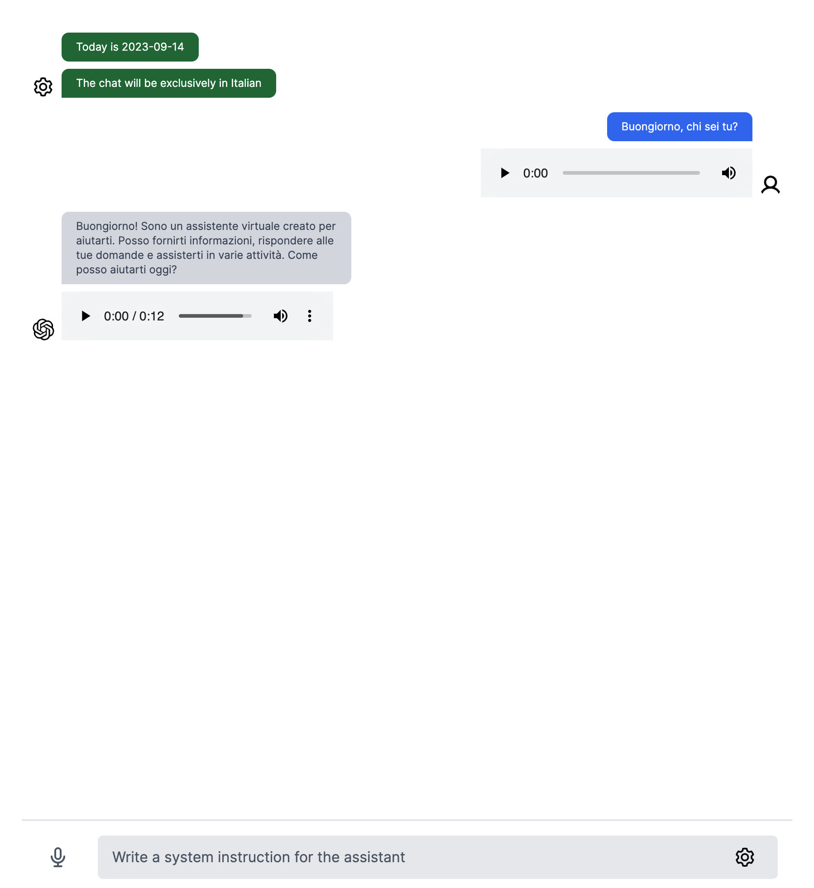

# Audio ChatGPT

## Tech

- [x] Next.js app router
- [x] OpenAI `gpt-3.5-turbo-0613` for chat completion  with functions
- [x] OpenAI `whisper-1` for speech-to-text 
- [x] AWS `Polly` for text-to-speech
- [x] AWS `S3` for audio storage


## Screenshot



## Getting Started

First, run the development server:

Copy `.env.local.example` to `.env.local` and set up the variables

```dotenv
  OPENAI_ORGANIZATION=org-
  OPENAI_API_KEY=sk-

  AWS_ACCESS_KEY_ID=
  AWS_SECRET_ACCESS_KEY=
  AWS_REGION=eu-central-1
  S3_BUCKET=
```

>ElevenLabs text-to-speech works very well with english, but when you use other languages like Italian, it says words in Italian and numbers (an time) in English. So, this project uses AWS Polly, but you can import textToSpeech from lib/eleven-labs.

```bash
npm run dev
```

Open [http://localhost:3000](http://localhost:3000) with your browser to see the result.